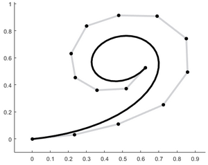
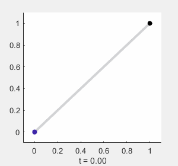
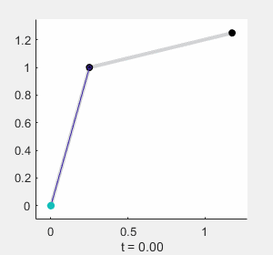
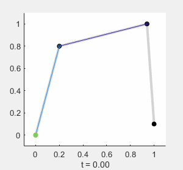
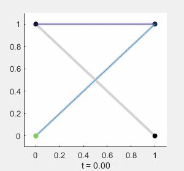

## A general introduction to Bézier curves

A Bézier curve is a parametric curve defined by a set of points in a given order, providing a computationaly simple calculation for a smooth curve. A Bézier curde of order $n$ can be calculated from a set of $n+1$ points, designated as $P_0, P_1, P_2, ... P_n$ where $P_0$ is the starting point of the Bézier curve, and $P_n$ is the endpoint of the curve.

  

*Note: all examples made in this document are for 2-dimensional curves, conteines within a surface. The process is identical for 3-dimensional curves.*

#### General definition
The general form of a Bézier curve is given by the following definition:

$B(t) = \sum_{i=0}^n b_{i,n}(t)P_i$

Where $t \in [0,1]$ is the parametric variable, $P_i$ represents each of the $n+1$ control points, and $b_{i,n}(t)$ is the Bernstein basis polynomial of degree $n$, defined as the polinomial coefficient of $n,i$ multiplied by an exponential function of t:

$b_{i,n}(t) = \left( \begin{array}{c}n \\ i \end{array} \right)t^i\left(1-t\right)^{n-i}=\frac{n!}{i!\left(n-i\right)!}\:t^i\left(1-t\right)^{n-i}$

#### Linear Bézier curves $(n=1)$
A first-order, or linear Bézier curve, is equivalent to a linear interpolation between two points:

$B(t) = P_0 + t\left(P_1 - P_0\right)$

#### Quadratic Bézier curves $(n=2)$
A second-order, or quadratic Bézier curve, is given by the following equation:

$B(t) = P_1 + (1-t)^2\left(P_0-P_1\right) + t^2\left(P_2 - P_1\right)$

As can be seen in both the expression and the following representaton, this curve is symmetric about the point $P_1$. I can also be seen as a linear interpolation in each instant $t$ between the linear curves which connect $P_0$ to $P_1$ and $P_1$ to $P_2$.

### Cubic Bézier curves $(n=3)$
In a third-order or cubic Bézier curve, is given by the following expression:

$B(t) = (1-t)^3P_0+3(1-t)^2 t P_1 +3(1-t)t^2P_2 + t^3P_3$

In this curve, the linear interpolation is repeated recursively. As seen in the animation below, the pale plue dots each describe a quatratic curve as defined by three points, and the resulting Bézier curve comes from a linear interpolation of the travelling points.

This curve can also be represented as a conbination of the quadratic Bézier curves between subsets of its points:

$B(t) = (1-t)B_{P_0,P_1,P_2}(t) + tB_{P_1,P_2,P_3}(t)$

This property is the basis of De Casteljau's algorithm, which will be seen in the next section.

In addition, depending on the point distribution, cubic curves (as well as curves of higher order) can take on more complex shapes, or even cusps:

