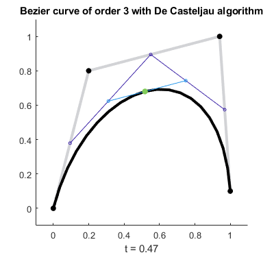
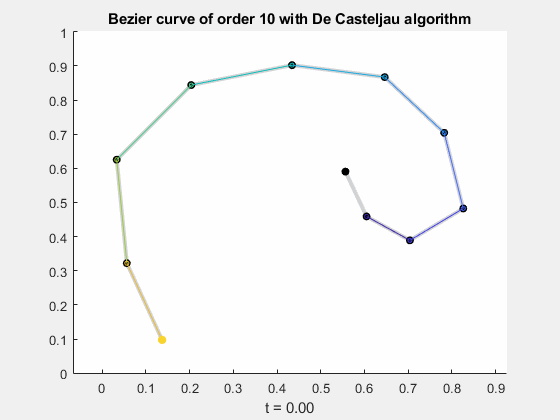
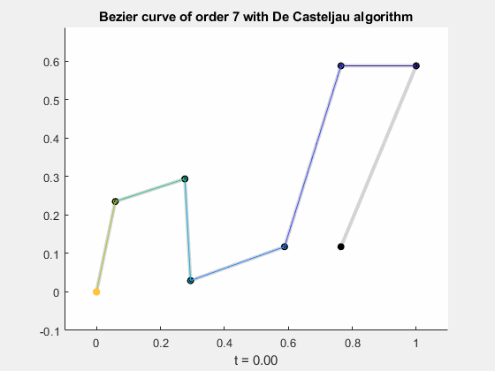

[<- go back](https://alosola.github.io/trajectory/)

## De Casteljau's algorithm for construction of Bézier curves

The equation provided as the general definition of a Bézier curve allows the simple calculation of a curve with $n+1$ sum operations:

$B(t) = \sum_{i=0}^n b_{i,n}(t)P_i$

This equation allows for a very quick calculation of a Bézier curve--however an alternate method can be used to find the Bézier curve using the linear interpolation property. In this algorithm, each point along the Bézier curve is calculated by bisecting the lines connnecting the control points $n$ times until the curve is determined.

  

Therefore, for each value of $t$, the Bézier curve at that instant is calculated as the following:

$B(t) = \sum_{i=0}^n \sum_{j=1}^{n} (1-t) B_{j,i} + t B_{j+1,i+1}$

For example, for a tenth-order curve, the calculation at instant $t=0.5$ has the following representation:

  

Running this calculation at all instants allows for the generation of the following animations:

The code implemented in MATLAB 2020b and available in the [GitHub repository](https://github.com/alosola/trajectory/tree/main/bezier/code) allows for the generation of these animations for any given set of points.

## Relative calculation speed

The calculation of a Bézier curve with De Casteljau's algorithm, while visually attractive, is much more expensive computationally than the direct approach. In a quick analysis using 10 sample cases with varying numbers of points, and solving each curve with a varying number of steps (between 10 and 200), the direct calculation (using the Bernstein basis polynomials) was 4.26% of the computation time, on average.
